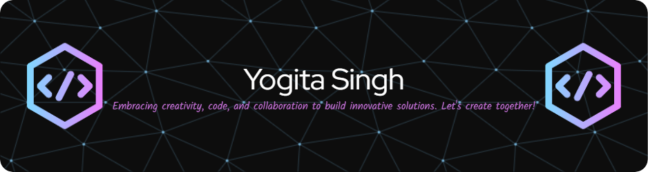

<h1>Hi there 👋</h1>

-🔭 I’m currently working on web devlopment
</a>

- 🌱 I’m currently learning react and machine learning 
</a>

- 👯 I’m looking to collaborate on open source projects
</a>

- 💬 Ask me about frontend web development
</a>

- 📫 How to reach me: <button> <a href="mailto: yogitasingh14092@gmail.com">Send email</a></button>

- 😄 Pronouns:she\her
</a>

- ⚡ Fun fact: I design, and then code 
</a> 
<h2>Github Statistics</h2>

  
 <h2>Languages and Tools</h2>
 
 
 
 
 
 
 
 
 
 
  
 <h2>Frameworks, Platforms and Libraries</h2>
 
 
  
 <h2>IDEs/Editors</h2>
 
 
  
 
 
 
<h2>Github Streak</h2>

<!--
**YogitaSingh9/YogitaSingh9** is a ✨ _special_ ✨ repository because its `README.md` (this file) appears on your GitHub profile.

Here are some ideas to get you started:

- 🔭 I’m currently working on ...
- 🌱 I’m currently learning ...
- 👯 I’m looking to collaborate on ...
- 🤔 I’m looking for help with ...
- 💬 Ask me about ...
- 📫 How to reach me: ...
- 😄 Pronouns: ...
- ⚡ Fun fact: ...
-->
